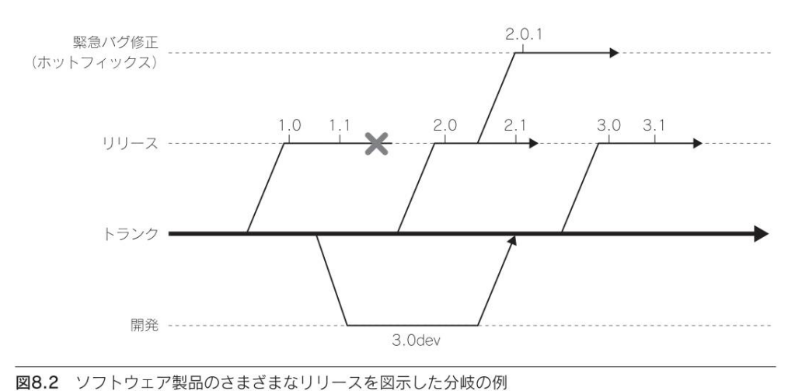

## 第8章　バージョン管理
### 概要
APIのリリースバージョン(1.0)の後に様々な理由(バグ修正、新機能統合など)でバージョンをリリースする

新バージョン作成時の最大の目的：新バージョンリリース後に既存のクライアントに与えるインパクトを限りなくゼロに近くする
→クライアントが新しいAPIを利用するためにコードを更新する手間を減らす(互換性)

### 8.1　バージョン番号
#### 8.1.1 バージョン番号の意味
ソフトウェア製品のリリースの変化の度合いを「.」区切りでの数字を付けており、2~3個の整数を使うものが一般的である。

1. メジャーバージョン
   - 最初のバージョン番号。大きな変更が行われた場合に増加する。
   - 後方互換性のある大きな新機能の追加や後方互換性が壊れた場合などのAPIの大きな変更
2. マイナーバージョン
   - 2番目の数字。小さな機能や大きなバグ修正が追加された場合に増加する。メジャーリリース後は0になる基本的に互換性のないAPI変更はない
   - ソフトウェアを変更せずに新しいマイナーリリースにアップグレードできるが、追加された新機能を使った場合以前のマイナーバージョンに戻るにはコードを変更する必要がある
3. パッチバージョン
   - 3番目の数字でパッチ番号。重要なバグ修正やセキュリティ修正がリリースされると数字が増加する。マイナーリリース後は0になる。パッチ番号が増加してもAPIの振る舞いに変化はない
   - パッチバージョンの変化は後方互換及び前方互換。コードを書き換えることなく前のパッチバージョンに戻ったり、最新のパッチバージョンに切り替えることができる

「1.0.0a」、「1.0.0b」などのように開発プロセスの段階を示す場合もある


#### 8.1.2 深遠なバージョン番号
組織処理システムのTeXは円周率を使ってバージョン番号を管理している。

#### 8.1.3 バージョンAPIの作成
APIの最新バージョンにしかないメソッドを呼び出す際、APIのバージョンをユーザがクエリできるようになると動的なAPIの呼び出しなどを行うことができる。
```
#include<srting>
#define API_MAJOR 1
#define API_MINOR 1
#define API_PATCH 1

class Version
{
public:
   static int GetMajor();
   static int GetMinor();
   static int GetPatch();
   static std::string GetVersion();
   static bool HasFeature(const std::string &name);
};
```
注意点
- 定数に#defineを用いている(プリプロセッサからアクセスできるように例外的に用いる)
- バージョンの比較ができるメソッドを提供している(大抵は最新との比較)
- 欲しい機能の存在を直接テストをするメソッド
- スレッドセーフにした場合「THREADSAFE」の機能タグを追加すると確認することができる。機能タグをバージョンAPIに入れておくとどのリリースにおいてもこのメソッドを呼び出すことができる

```
if (Version:HasFeture("THREADSAFE"))
{
   ...
}
```


### 8.2 ソフトウェアの分岐戦略
- 大規模なソフトウェアプロジェクトでは分岐戦略を用いて同時開発、安定化、保守を行う

#### 8.2.1 分岐戦略
ソースコードのリポジトリ
- トランク：木の幹
  - 永続的なリポジトリ
- ブランチ：枝
  - 個別のリリースや開発作業
- 次期リリースが間に合わない長期的な開発作業は独自のブランチ→合流

#### 8.2.2 分岐のルール
多くのプロジェクトで上記の構造を用いているが、細かいルールはカスタマイズすることができる
- どの開発者がどのブランチを使うか
- 同時並行で開発を行うブランチの本数
- マージの頻度
- ブランチ間の自動マージ

本書推奨の分岐ルール
- 継続的な開発作業はトランク
  - マージの際は必ず品質チェックを行う
- 長期的な作業は開発
- 通常はMercurialやgitのような分散SCM(ソース制御)システムを使うことでマージが簡単かつコンパクトになる
- 開発者が全員施設内で作業する場合はPerforceなどのサーバベースのソリューションが有用

#### 8.2.3 APIと並行ブランチ
APIを一度リリースするとその後の変更は連続性を保つ必要がある=互換性のないAPIをリリースしてはいけない

自明なことであるが、複数の開発が並行して行われている場合1つのAPIに対して同時に複数のリリースが存在する可能性があり、並行したブランチ間での互換性を確保しておく必要がある
- 開発ブランチのターゲット化
  - リリースブランチで直接APIの変更を行わない。リリースブランチでAPIの変更を行う場合はトランクにコミットし、そこからリリースにマージすることで、リリースブランチで追加した機能がトランクに合流しないことで失われる可能性をなくす
- トランクへのマージは頻繁に
  - 開発ブランチのマージで競合する事態を回避するためパブリックAPIへの変更はトランクコードで開発するかできるだけ早くトランクコードにマージすることが良いとされる
- レビュープロセス
  - パブリックAPIに対する変更をAPIレビュー委員会によってリリース前に監督する(競合、後方互換性の確認)

この3つによりAPIの真の定義をトランクのコードラインに1つ保持し複数のブランチにわたって変更が散在しないようにすることが目標


#### 8.2.4 ファイル形式と並行製品
複雑なバージョン管理になってしまった例
- 継続していた製品を基本版、高度版2バージョンの製品を開発することになった
- これまでは1バージョンで1つのファイル形式で、互換性のない変更を導入する場合メジャーバージョン番号を増加させる
- 1バージョンのみの段階で3.0(ファイル形式はXMLベース)
  - 新しい製品でも互換性があればファイルを読み込めていた(タグは無視して読み込める)
  - 2つのバージョンとも3.0以前のファイルは全て読み込める
1. 高度版でファイル形式に後方互換性のない新機能を導入した4.xに更新
2. ファイル形式全体を互換性のない形で進化させる必要があり、基本版を5.x、高度版は6.xに更新


解決策
- バージョン情報(バージョン番号)とファイル形式(変種名)のバージョンが融合している
- 生成ファイルをBasicとAdvancedと分けてバージョン番号空間を2つ生成することで、バージョン番号だけで基本版か高度版かを判断しないようにする

### 8.3 APIのライフサイクル
- API誕生から終了までの段階について
- API開発はソフトウェア製品とは違いクラス名やメソッド名を変更しクライアントのコードを破壊する事がないよう開発時点で制約が多く存在し、保守の内容も異なる(API=契約)

APIのライフサイクル

- リリース前
  - リリース前に要件の収集・計画・設計・実装・テストを行う
  - 大きな変更や再設計はこの段階でしか行えない(リリース後は後方互換性を担保しなければならない)
  - リリース前のAPIを0.xとしてユーザに提供しFBや提案を受けることができる
- 保守
  - 後方互換性を守るための新規メソッドやクラスの追加や既存メソッドに対するバグの修正
    - 互換性を守るために回帰テスト(追加修正していない部分が正しく動作しているかどうかのテスト)とAPIレビューを行うことがベストプラクティス
- 完成
  - これ以上の変更は必要ないと判断した場合「完成」とする
  - バグ修正のみが検討される
- 廃止
  - APIが役に立たなくなったり、互換性のない新規のAPIが開発されて置き換えられた場合に行う
  - APIを新規開発に用いることはできなくなり、既存のクライアントはそのAPIから移行する必要がある


### 8.4 互換性のレベル
- 各互換性の厳密な定義について説明する
- メジャーリリース、マイナーリリース、パッチリリースのそれぞれで色々なレベルの互換性を約束することになる
#### 8.4.1 後方互換性
- 前バージョンのAPIと同じ機能性を提供するAPIのこと
  - 何も変更する必要もなく前バージョンと同じAPIと完全に置き換えることができる
  - 古いAPIで定義されている機能を互換性のない形で変更してはいけない

後方互換性の種類(後セクションで解説)
- 機能的互換性
- ソース互換性
- バイナリ互換性

データ指向の後方互換性
- クライアント/サーバ互換性
  - 旧バージョンを使っているクライアントも新バージョンのサーバと通信できる
  - 逆に新バージョンを使っているクライアントは古いバージョンのサーバと通信できる必要がある
- ファイル形式互換性
  - 最新バージョンのAPIは古いバージョンのAPIが作成したファイルは読めなくてはならない


#### 8.4.2 機能的互換性
- APIの実行時の振る舞いが前バージョンのAPIとまったく同じである
  - この意味で100%後方互換性のあるAPIは存在しない

理由
```
void SetImage(Image *img);
```
- 1.0でNULLポインタを渡すとクラッシュするバグがあったとし、1.1でバグを修正したとする。この時点でAPIの振る舞いは変わるため機能的互換性はない

#### 8.4.3 ソース互換性
- コードを変更せずに新バージョンのAPIでプログラムを再コンパイルすることができる(振る舞いは関係ない)
- 以下の2つの関数はソース互換性がある例

```
//バージョン1.0
void SetImage(Image *img);
//バージョン1.1
void SetImage(Image *img, bool keep_aspect=true);
```
新しい引数はオプション引数である。ただ、以下のようにするとユーザは全てのSetImageについて書き換える必要があるためソース互換性はない
```
//バージョン1.0
void SetImage(Image *img);

//バージョン1.1
void SetImage(Image *img, bool keep_aspect);
```


#### 8.4.4 バイナリ互換性
- クライアントがスタティックライブラリの新バージョンと再リンクする必要があるだけ or エンドユーザアプリケーションのインストールディレクトリに新しい共有ライブラリを入れるだけでよい
- APIの変更が、ライブラリファイルのクラス・メソッド・関数の表現に影響を与えない。APIの全要素のバイナリ要素は型・サイズ・構造体のアライメント、関数のシグネチャ含めて同じである
- 下記コードは生成するマングル(オブジェクトまたはライブラリファイルの関数を特定するのに使用するシンボル名)が異なるためソース互換性はあるが、バイナリ互換性はない
```
//バージョン1.0
void SetImage(Image *img);
->_Z8SetImageP5Image

//バージョン1.1
void SetImage(Image *img, bool keep_aspect=false);
->_Z8SetImageP5Imageb
```

バイナリ互換性のないAPI変更(本参照)


#### 8.4.5 前方互換性
- 将来のAPIで記述したクライアントコードが変更せずに旧版のAPIでコンパイルできる(ダウングレード可能)。ただ、予期せぬエラーが起こりうることもあるため、前方互換性を保証するのは難しい
- 通常、機能を追加した際は前方互換性は保つことができないが、例えば以下の例では前方互換性が保たれる

```
//バージョン1.0
void SetImage(Image *img, bool unused=false);

//バージョン1.1
void SetImage(Image *img, bool keep_aspect);
```
逆に以下の例では前方互換性はない(1.1の2番目の引数が指定されているため)
```
//バージョン1.0
void SetImage(Image *img);

//バージョン1.1
void SetImage(Image *img, bool keep_aspect=false);
```

APIの前方互換性を保つための手法
- メソッドにパラメータを追加する場合は一つ目のテクニックを使う
- 別の組み込み型に切り替える可能性がある場合、組み込み型を直接使わずオペークポイントやtypedefを使う事ができる
- 5章のデータ駆動型はそもそも前方互換性のAPIであり、関数のシグネチャを変更しなくても新しい名前の引数をサポートできる
